# Navigation

* [Project Overview](#project-overview)
* [Authorship Credits](#authorship-credits)
* [About React](#about-react)
* [Getting Started: Setting Up a React Local Development Environment](#getting-started-setting-up-a-react-local-development-environment)
* [Stage 1: Application Planning and Building a Static Website](#stage-1-planning-and-static-application-build-out)
* [Stage 2: Adding State and Build-out Master-Detail Functionality](#stage-2-add-state-and-build-out-master-detail-functionality)
* [Stage 3: Expanding State by Adding Create and Delete Functionality](#stage-3-expand-state-by-adding-create-and-delete-functionality)
* [Stage 4: Adding Update Functionality](#stage-4-completing-the-application-by-adding-update-functionality)
* [Credits](#credits)
* [Conclusions and Next Steps](#conclusions-and-next-steps)

# Project Overview

This tutorial was created for Facebook's 2020 Developer's challenge. It guides the learner in the creation of a harvest inventory app for a family-owned organic farm in North Carolina called *Arroyo Family Farms*.

The goal of this tutorial is to provide a strong foundation in React. To this end, a discussion of basic and intermediate React development concepts is undertaken. Additional emphasis is placed on understanding **ESCM Script version 6 (ES6)** additions to Javascript. concepts required to develop proficiency as a React development developer.  

The learner is guided in creating stateful and interactive [master-detail interface](https://www.google.com/search?q=what+is+a+master-detail+list%3F) with Create, Update, and Delete (CRUD) functionality. This application may be readily adapted to create variety of applications (e.g., online store, an addressbok, and a todo-list).

Given the comprehensiveness of this tutorial, it is strongly recommended that you use the navigation menu to focus on sections most relevant to your learning needs. 

Finally, the code is fairly well documented, so you are also encouraged to read through the comments within the codebase.

## License

Additionally this project is being made available to the public under an MIT open source license.


# Authorship Credits

This tutorial and its resulting application were created by **Marcus "Arroyo" B.**   


---
# About React
React is a Javascript library created by Facebook. It is focused on User Interface (UI) rendering (i.e., the view component of the Model View Controller \[MVC\] design pattern). It was open-sourced to the developer community on [May 29, 2013](https://blog.risingstack.com/the-history-of-react-js-on-a-timeline#2013theyearofthebiglaunch). 

React uses JavasScript ES6 and its apps are often coded in [JSX](https://www.google.com/search?what+is+JSX?). JSX allows the developer to combine HTML and JavaScript in the same line of code.  

## React Coding Conventions
In React, functional and class components are declared using `PascalCase` (i.e., **must** have a capital letter).  Methods, functions within functional components, variables, and constants are declared using `camelCase` (i.e., first letter is lowercase).

Technically you can have all your  components in 1 file, however, for manageability, React developers prefer to have one component per file and use import and export statements to assemble an application. 

Refer to the Reacts documentation for more info on [conventions and use](https://reactjs.org/docs/components-and-props.html).


## Updates to JavaScript Via ES6

React uses Javascript ES6. ES6 brings new features (e.g., the support of classes) to JavaScript that are common in traditional objected oriented languages such as C, Java, and Python. For the purpose of this tutorial, we will focus on the newly added `const` and `let` keywords as well as support for arrow functions `() =>`. React uses the [Babel](https://www.google.com/search?q=what+is+babel) transcompiler which allows ES6 to be backward compatible with older and non-chromium based browsers.

*[`let`:](https://developer.mozilla.org/en-US/docs/Web/JavaScript/Reference/Statements/let#Description)* is a variable declaration like var, but it is "hyper-localized" and is limited to a given code block in which it is assigned.  Conclusion: let is preferred to `var` due its granular, block-constrained localization which helps create more predictable code outcomes.

*[`const`:](https://developer.mozilla.org/en-US/docs/Web/JavaScript/Reference/statements/const#Description)* is the constant declaration. It is also *hyper-localized* and is limited to a given code block in which it is assigned. Conclusion:  Functions can be assigned to constants and are often used in react for function declarations using arrow functions. In React, we typically don't write our constants in all-caps. Method names are written as first letter c

### Arrow Functions: `() =>`

Like `let` and `const`, arrow functions are "hyper-localized". This means they are only "aware of" and execute in the scope where they were created. On the otherhand, traditional JavaScript functions bubble up to the window scope.

 Because of scope localization, arrow functions are of particular interest to react developers using class functions and referencing instances of `this`.  Arrow functions negate the need to "manually" bind functions to a given class within its constructor. [Mozilla](https://developer.mozilla.org/en-US/docs/Web/JavaScript/Reference/Functions/Arrow_functions) has a great tutorial on arrow functions. The below example shows a traditional function and its arrow function equivalent:

```javascript
const OUTER = 10;

//Traditional Function
function MyComponent(){
  let number = 3;
  number = number*OUTER; //expect 3*10 = 3-
  return number;
}

//Arrow Function
const MyOtherComponent = () => {
  let number = 3;
  number = number*OUTER; //expect 3*10 = 3-
  return number;  
}
```


> PRO TIP 1: A good rule of thumb for beginners is to **always use arrow functions** when defining methods within class components. 

If arrow functions are not used to create a method, the method must be "manually" binded the class in the constructor like so: `this.myMethodName = this.myMethodName.bind(this);`

If you choose to use arrow functions to define functional components, declare them as constants via `const`.

> PRO TIP 2: If your event handler (e.g., onClick, onMouseOver, etc) requires arguments to be passed, you must use arrow functions to prevent the function from automatically executing when the page is rendered


### Import and Export Statements

React leverages ES6 import and export statements for modularity.  React modules (i.e, components) must be exported in order to be imported.  Exports may either be named or "default".   We'll use both types in this project. Refer to [Mozilla](https://developer.mozilla.org/en-US/docs/web/javascript/reference/statements/export) for documentation.


## React Components

A React application is composed of *modular pieces of code* which compute and/or display a portion of application's UI. These modular pieces are called are encapsulated *components*.  According to the [React documentation](https://reactjs.org/docs/thinking-in-react.html), as a best-practice, components should follow the single-use principle of SOLID Obect Oriented (OO) design.   If you are not familiar with SOLID principles, [Hash Bang Code](https://www.hashbangcode.com/article/solid-principles-php) has a excellent tutorial.

Ideally, each component represents a portion of our view. Within react there are two kinds of components: functional and class. This means that React applications may be either created using OO Classes or pure functions.


### Functional Components
Functional components in React are composed of pure functions which are [first class objects (functions)](https://developer.mozilla.org/en-US/docs/Glossary/First-class_Function) in JavaScript. As functions, a given set of inputs will always provide a predicatble and guaranteed output. As first class objects, JavaScript functions may be treated as variables.


   * **PRO TIP 3:** Generally speaking, child components should be functional components and not manage state. In fact, their state must be lifted into and therefore managed by its parent

   * **PRO TIP 4:** If you find yourself repeating the same lines of code throughout a given parent or child component, combine that code into a method or function. Then call when needed

   * **PRO TIP 5:** If you find yourself needing the same function in more than 2 component's, separate that function into an additional file and import it where needed!


### Class Components
Class components are OO constructs that  are used to manage state in React applications. Every class component in React must have a `render()` method with a `return` statement.

   * **PRO TIP 6:** Create a single parent component that will control application state. This parent component will be a class component


---
# Getting Started: Setting-up a React Local Development Environment 

## A. VSCode Setup

[VS Code](https://code.visualstudio.com/) is our editor of choice. The below suggestions will optimize it for React development

1. Install [Babel Javascript](https://marketplace.visualstudio.com/items?itemName=mgmcdermott.vscode-language-babel).  Created by Michael McDermont, it provides VSCode syntax highlighting for JavaScript ES6, React JSX, Flow, and GraphQL.


2. Install Sergii Naumov's [Oceanic Theme](https://marketplace.visualstudio.com/items?itemName=naumovs.theme-oceanicnext). It supports a more granular level of syntax highlighting for nested properties.

## B. React Environment Setup

1. Install the LTS of version of [node.js](https://nodejs.org/en/). 


2. Using your terminal (i.e., CLI), navigate to the project folder where you will save the project.  

  
3. Within your terminal type `npx create-react-app  admin-panel`  

   ->i. NB: `admin-panel` is the name of the application in this tutorial.
  
   ->ii. Refer to the [official react tutorials](https://reactjs.org/docs/create-a-new-react-app.html#create-react-app) to learn more about the `npx` and `create-react-app` directves  

4. Finally, type `npm start` to run the default react application. The app will render on your local machine at http://localhost:3000

## C. `create-react-app`: Understanding Default Files and Directory Structure

1. **node_modules/:** Standard node folder to store dependencies, packages (e.g., Babel) and libraries (e.g., React).

1.  **package.json:** Standard configuration and script setup file for node projects. You may specify dependencies and embed [custom scripts](https://css-tricks.com/why-npm-scripts/) to automate your development workflow

1.  **public/:** Folder with global read privileges (i.e., public , web accessible).  Only store public content here such as images and html files. **Optional TODO:** You're welcomed to change or delete the favicon, manifest, and logo files to suit your project's needs. But, be sure `index.html` also reflects those changes. `logo512.png` will not be used in our project so you're welcomed to delete it.

1.  **public/index.html:** Used by index.js to render the react app.  The app gets rendered to an arbitrary id's (default is 'root') DOM in this file  via this code `<div id="root"></div>`

1.  **index.css:** Global stylesheet for the react project. Within the React developer community it is considered a best practice to opt for component-specific CSS.  Such CSS is written directly into the component.  It's accomplished via CSS objects or [CSS in JavaScript libraries](https://www.npmtrends.com/styled-components-vs-emotion-vs-react-bootstrap] such as styled-components, react-bootstrap, etc.

1.  **App.css:** external style sheet for App.js. It is minified and aggregated into a 'global' style sheet on application build and compile. **TODO:** Delete this file
 
1.  **index.js:**  Renders App.js component to an arbitrary id (default is id 'root') in `public/index.html`. NB: A file which injects code (i.e., component) directly to the HTML DOM is often referred as an application entry point. **TODO:** Open this file and update to `import App from './components/App'`

1. **App.js:** A container component and parent for react react applications.   **TODO:** Delete its contents and move to `src/components` 
 

 ### Updating the Directory Structure

1. Create `components/` and `images/` folders under the `src/` directory.

2. Delete `App.css` and `App-test.js` from `src/.`  Move `App.js` into  `components/`

3. If you haven't done so already, follow the *TODOs* mentioned above, in Part C.

We'll add our component files in the next section. However, your folder structure should resemble this:

```text
admin-panel/
  ├──📁 node_modules/
  ├──📁 public/
  │ ├── index.html
  | |     ...
  | |── favicon.ico  
  | └── robots.txt
  ├──📁 src/
  │ ├──📁 components/
  | | ├── App.js 
  │ | |── ComponentNum_1.js
  | | |     ...
  │ | └── ComponentNum_n.js
  | └──📁images/
  |
  ├── index.css
  ├── index.js
  ├── .gitignore
  ├── package.json
  └── README.md
```

---

# Stage 1: Planning and Static Application Build Out

Our first step is to create a static, non-interactive website. Often the abode of UX/UI specialists, wireframing is a common way to plan an application's design and development.  As a developer, you will find that diagraming an application's layout is an expedient and tactical methodlogy for planning and strategizing React applications.

You may use a pencil and paper, Photoshop, or free online alternatives such as [Diagrams.net](https://www.diagrams.net/index.html).  However, in this tutorial a color-block diagram is used to depict the layout.

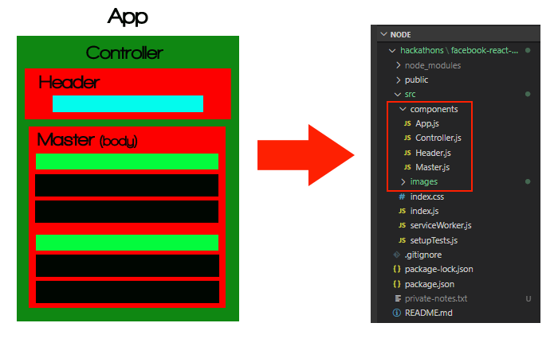 

  **Figure 2: Stage 1 - Application Layout Diagram with Corresponding File Structure**

**Note:** As shown in the folder in Figure 2, each part of the application which is responsible for rendering view a should be its own component. Clearly, we need to use our judgement in deciding to what level we 'componentize' our App.  However, the wireframe provides a provides a pre-development game paln for development of our application.

**Take Away:** Each section of the wireframe will will respresent a React Component. Each Component may be further subdivided into additonal ones, if needed.


## Coding the Static Website: App.js, Controller.js, Header.js, and Master.js

The code for the App, Controller, Header, and Master components is shown in Figure 2 with comments.  Here is a summary:

1. **Controller.js:** Will manage the ensuing complexity of our application. Controller dictates the layout of each component. In future iterations it will manage application state. 

2.  **Master.js:** Does the heavy lifting.  Lines Lines 4 through 38 show that we store our inventory in a JSON array. In the real-world we would store ur inventory in a database. In lines 40 through of Master.js (see figure 3 below) we use the [`Array.map()`](https://developer.mozilla.org/en-US/docs/Web/JavaScript/Reference/Global_Objects/Array/map) method to iterate over a JSON array of items.  A copy of the Stage 1 Master.js file is [available for download](GITHUB LINK HERE)

3. **Header.js:** Displays the title of the application. Also uses JavaScript's length property to count the total inventory.

4.  **App.js:** Many developers prefer to keep App.js simple. For this project, it will maintain its utility as a single point of entry called by index.js for rendering into index.html. Controller is imported into App.js


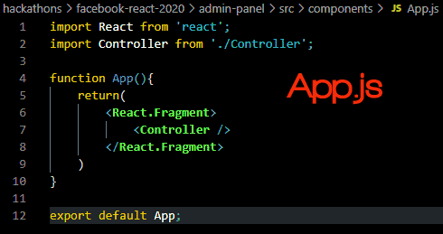) 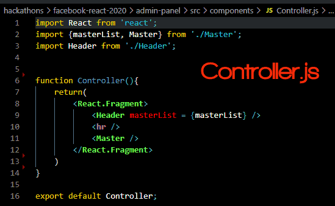

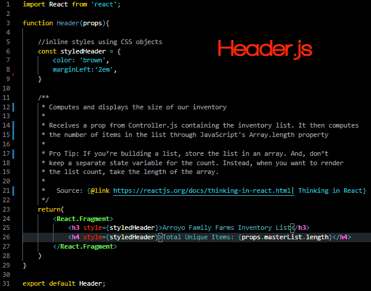) 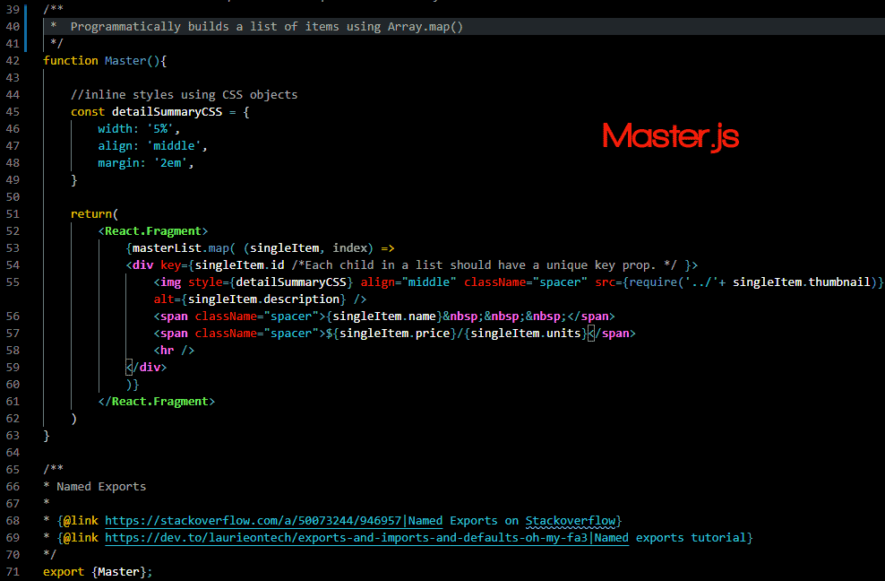
**Figure 3: App.js, Controller.js, Header.js, and Master.js**

Given the simplicity of the current iteration of our application, it may be argued that the above is overkill.  That perhaps all of this code could be placed in one file.  All true, however, as developers we alway want to code with modularity, ease of maintenance, and amenability to refactoring in mind. As we build-out our application and add state, the logic of this design pattern will become clearer.


### Resulting Website

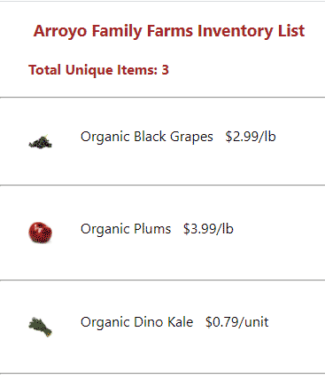

**Figure 4: Stage 1: The Static Application Produced by Our 3 Files**

---
# Stage 2: Add State and Build-out Master-Detail Functionality

**PRO TIP 7**
     > Figure out the absolute minimal representation of the state your 
     > application needs and compute everything else you need on-demand." 
     > 
     >  *- [Thinking in React](https://reactjs.org/docs/thinking-in-react.html)*

Stage 2 involves converting our Controller to a class component to manage state.  We will also create `Detail.js` which will contain JSX for rendering the detail page.

Although each React component may generate and contain data, it is a best practice to *lift state up* to the parent component. *Lifting up state* is a core React design principle. It brings organization and simplicity to what can potentially be quite complex and unwieldy codebase.

As mentioned earlier, state is complex and it's easier to have one file as a nexus and controller of all things state.

Here is our updated application layout:

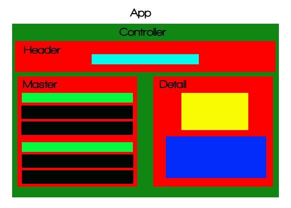 

**Figure 5: Layout Diagram for Master Detail**

Now, by clicking an item on the master page, we are transported to a detail page.

Let's analyze the key pieces of code added:

## 1. Controller.js Analysis

We've converted the controller to a class component to manage state. An application having state implies memory as well as storage of volatile data or a layout/representation in the DOM. Explanations to code section are embedded in the images via code comments.  Our code in the controller may be divided into 3 methods

### `constructor()`
First, the required constructor method is added to initialize state as described in Figure 6: 

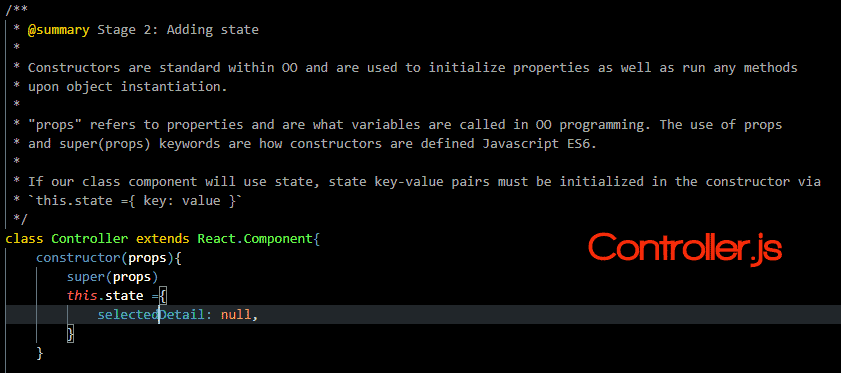

**Figure 6: Analysis of Controller's Constructor Method**

Second, we have our event handler that determines which item's detail to render. Figure 7, Analysis of Controller's handleSelectedDetail Method, explains the code:

### `handleSelectedDetail()`
Of note in Figure 6 is JavaScript's built-in [`Array.filter()`](https://developer.mozilla.org/en/docs/Web/JavaScript/Reference/Global_Objects/Array/filter) method and is the use of [`setState()`](https://www.google.com/search?q=setState()) to a assign new value to the `SelectedDetail` state variable. In React, [`setState()`](https://www.google.com/search?q=setState()) is always called to update state variables.


")

**Figure 7: Analysis of Controller's handleSelectedDetail Method**


### `render()`

Finally, in Figure 8  we have the updated render method. It sends its view presentation to `App.js` for rendering to the DOM:


")

**Figure 8: Analysis of Controller's Render Method with Emphasis on Callback Sent to the Master Componennt**

 
## 2. Master.js Analysis

Master.js and its callback are already discussed in detail within Figure 8's comments.  

However, it is worth mentionin that when passing arguments to other components, they are sent as objects. These objects are accessed with the "props" paramenter combined with dot notation. 


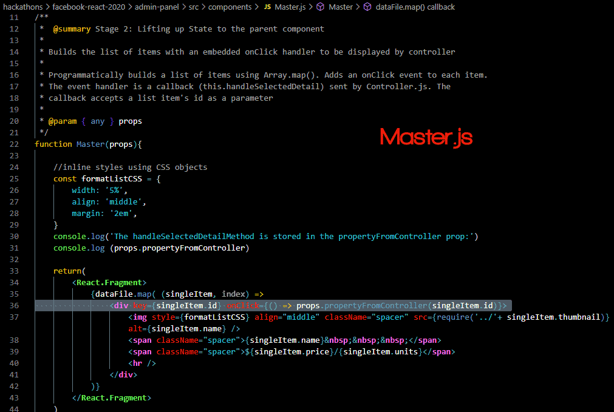

**Figure 9: The Master Component**


## 3. Detail.js Analysis


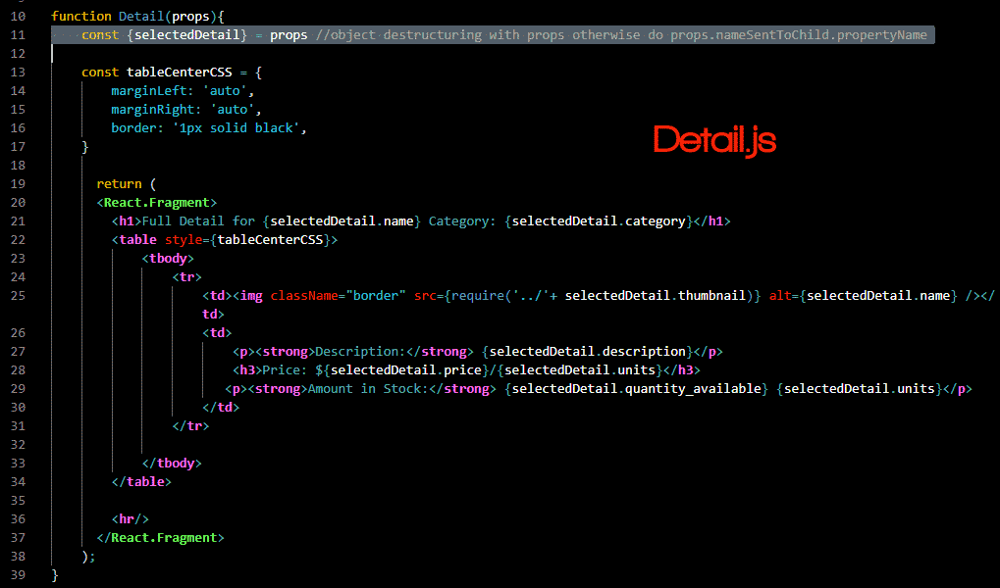

**Figure 10: The Detail Component**

---
# Stage 3: Expand State by Adding Create and Delete Functionality

As our Controller becomes mre complex it is prudent to identify ways to refactor and simplify our code.  In Stage 3,our controller uses conditionals to decide what to render to the user.  To manage the viw more eleganfly, we will create a custom method called renderView that will automate this process.


## Controller's `renderView()` Method

Render view is a helper method within Controller.  It which manages `this.state.view` and processes what gets displayed to the user. 


 Helper Method")

**Figure 11: The renderView() Helper Method for Stage 3 Manages Our Application's Increased Complexity**

## Controller's handleDelete() Method

Here is an analysis of the handleDelete method:


1. Retrieves a list of inventory items we wish to delete. This is stored in this.state.arrayToEdit

2. Makes a copy of the existing inventory array this.state.masterList

3. Applies [`Array.filter()`](https://developer.mozilla.org/en/docs/Web/JavaScript/Reference/Global_Objects/Array/filter) to the copy to return everything **_except_** the element contianing the ID we wish to delete


```JSX
    handleDelete = () => {
        
        console.log('Delete function called')

        if(this.state.arrayToEdit.length > 0){ 
               
            const confirmDelete = window.confirm('Are you sure you want to delete these ' + this.state.arrayToEdit.length + ' items?')
            
            if (confirmDelete === true) {

                let newMasterList = this.state.masterList 
                this.state.arrayToEdit.map( ( id, index) =>     
                    newMasterList = newMasterList.filter( detail => detail.id !== id)    
                )

                console.log(newMasterList)
            
                this.setState({

                    masterList: newMasterList, 

                }, function(){
                    this.emptyArrayToEdit()
                    console.log(this.state.masterList)
                    this.renderView( 
                        <h3>Success! { this.state.arrayToEdit.length } Item(s) Deleted</h3>  
                    )
                
                })

            }  else {
                this.emptyArrayToEdit()
                this.renderView(
                    <h3>Delete Process Canceled By User.</h3> 
                     )                  
            } 
         
        } else {

            this.renderView(
                <h3>Delete Attempt Aborted. Please Select an Item to Delete.</h3> 
                )                
        }    
    }
```
**Figure 12: Stage 3 - Delete Functionality Added to Controller**


## Create.js

The Create component displays the form to create a new item. However, controller processes the form through a callback function sent to the Create component. 

Of note: React requires that each item in a list that is rendered to DOM have a UUID.  In line 2 of [Create.js](src/components/Create.js#L2) we import the JavaScript's UUID library: `import { v4 } from 'uuid'`

In Figure 13, we invoke the UUID in line 44 of [Create.js](src/components/Create.js#L44) via `{ v4 }`


Please refer to the comments in Figure 13 for a additional analysis of Create.js

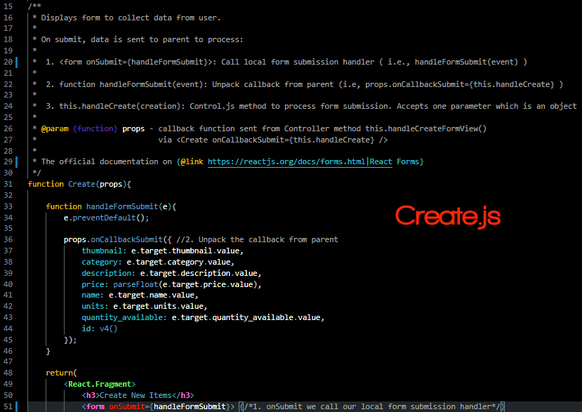


**Figure 13: Stage 3 - The Comments Explain the Create Component's Functionality**


## Controller's `handleCreateFormView()` Method

*`handleCreateFormView()`* sends a callback to Create.js and manipulates what's displayed on to the user

```JSX
    handleCreateFormView = () => {
        this.renderView('', <Create onCallbackSubmit={this.handleCreate} />) 
        this.hideButton('create-button')
        this.hideButton('update-button')
        this.hideButton('delete-button')
    }
```

**Figure 14: Stage 3 - The Controller's handleCreateFormView Method**

## Controller's `handleCreate()` Method

Examining line 2 of Figure 15, [`handleCreate()`](src/components/Controller.js#L231) concatenates the newly created inventory object to a copy of our inventory list (masterList). It then updates the masterList by means of [`setState()`](https://www.google.com/search?q=setState())


```JSX
    handleCreate = ( creation ) =>{
        const newMasterList = this.state.masterList.concat( creation )
        
        this.setState({
            masterList: newMasterList,
            }, function(){this.renderView( <h3>Successfuly Created {creation.name}!</h3> )}
        )

    }
```
**Figure 15: Stage 3 - The Controller's handleCreateFormView Method**


---
# Stage 4: Completing the Application by Adding Update Functionality 

To provide an optimal user experience, the update form was tightly integrated into what appears to be a the Detail view.  However, it is in fact separate component that overlays and HTML5 form into the code used to generate teh Detail component.

The React form property [`defaultValue`](https://reactjs.org/docs/uncontrolled-components.html#default-values) is used to pre-populate the form with the item's information.

Similar to Create.js, Update.js also receives a callback function from Controller.js. In turn, it sends teh form data back to parent via handleUpdate(). The code in Update.js is quite mundane, but feel free to [examine it]((src/components/Update.js#L231)).  Figure 16 is an excerpt.


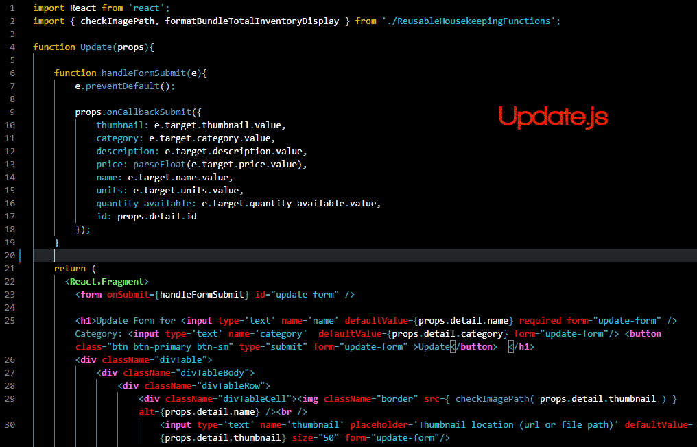

**Figure 16: Stage 4 - Excerpt of the Update Component**


Of much more interest, is how we manage updates in through the Controller:  

1. handleSelectedDetail()

    A housekeeping and helper method called handleSelectedDetail method. It uses a series of conditionals to determine if the detail or update view should be displayed.

2. handleUpdate()

    Updates the list by first removing the property being edited from a copy existing list. Afterwards, it concatenates the updated item the the copy. FInally, it uses setState() to actually update the masterList.  Do note these are array manipulation operations. If we were storing in a database. This functionality would be different.

```JSX
    handleUpdate = (updates) =>{
        const updatedDetail = this.state.masterList.filter( detail => detail.id !== updates.id).concat(updates)
        console.log('Contents of Updated Detail:')
        console.log(updatedDetail)
        this.setState({
            masterList: updatedDetail,
            }, function(){
                    this.emptyArrayToEdit()
                    this.renderView( 
                            <h3>Successfully Updated {updates.name}!</h3> 
                    )
                }
            )
    }
```

**Figure 17: Stage 4 - The Controller's `handleUpdate` Method**

---
# Credits

The pedagogical design of this tutorial was inspired by [Thinking in React](https://reactjs.org/docs/thinking-in-react.html).  

The application's UX was inspired by [Amazon's/Wholefoods mobile app](https://www.amazon.com/alm/storefront??tag=7475725-20)

The CSS used for the [action buttons](https://github.com/codesport/admin-panel/blob/main-final-public/src/index.css) is from [Adventures In Techland](https://www.adventuresintechland.com/bootstrap-css-buttons-only/)

As shown in Figure 18 below, the comments throughout this application's codebase reference specific Stackoverflow posts as well as other sources that were useful in building this application.

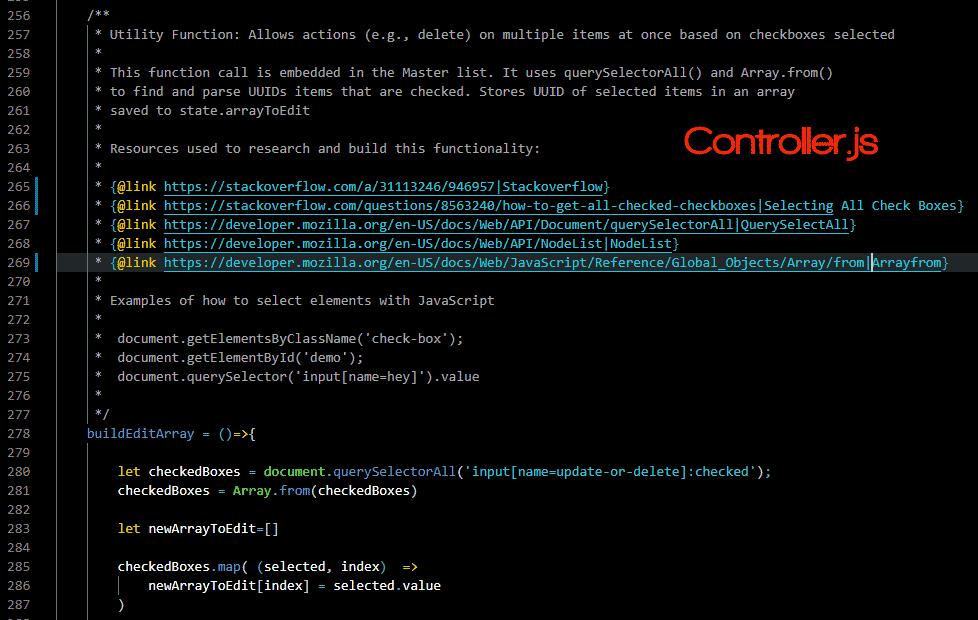

**Figure 18: Stage 4 - Comments explaining the `buildEditArray` Method in the Controller Component**

Special thanks to Hal Helms (Uncle Hal) who, through an online tutorial he authored a long time ago, showed me how to build my first CRUD application! Never did I expect to make tutorial for one of the most powerful companies in the world.


---
# Conclusions and Next Steps

This tutorial and its resulting code may be used as a template to build more advanced applications.  Expansion options include building an online store, a booking/reservations app, an address book, a todo-list, etc. 

As a React developer we have the opportunity to become better JavaScript developers and truly understand its power.  `create-react-app`'s use of ESLint provides numerous benefits that teach us to write more secure and stable code.

Next steps of this project would include:

* Integration with a NoSQL database such as Mongo or Firebase
* Adding Authentication and Access Control for security
* Hosting on a live sever running node and NGINX
* Potentially using Redux to manage state as our application continues to grow and state management becomes more complex
* Using Jest to run automated test and to incorporate test driven development best practices
* Explore using React Router as a means of handling navigation and URL management
* Integrating with APIs to pull in external data