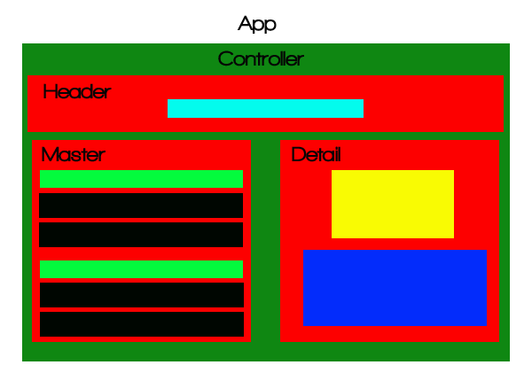

# Navigation

* [Project Overview and Authorship Credits](#introduction-and-project-overview)
* [About React](#aout-react)
* [Getting Started: Setting Up a React Local Development Environment](#authorship-and-credits)
* [Stage 1: Application Planning and Building a Static Website](#php-application-development-excercise-overview)
* [Stage 2: Adding State and Build-out Master-Detail Functionality](#php-application-development-excercise-task-description)
* [Stage 3: Expanding State by Adding Create and Delete Functionality]
* [Stage 4: Adding Update Functionality]
* [Conclusions and Next Steps]

# Project Overview and Authorship Credits

This tutorial was created for Facebook's 2020 Developer's challenge. It guides the learner in the creation of a harvest inventory app for a family-owned organic farm in North Carolina called *Arroyo Family Farms*.

The goal of this tutorial is to provide a strong foundation in React. To this end, a discussion of basic and intermediate React development concepts is undertaken. Additional emphasis is placed on understanding **ESCM Script version 6 (ES6)** additions to Javascript. concepts required to develop proficiency as a React development developer.  

The learner is guided in creating stateful and interactive [master-detail interface](https://www.google.com/search?q=what+is+a+master-detail+list%3F) with Create, Update, and Delete (CRUD) functionality. This application may be readily adpated to create variety of applications (e.g., online store, an addressbok, and a todo-list).

## Authorship Credits

This tutorial its resulting application were created by **Marcus "Arroyo" B.**. Arroyo is a Software Engineer In Residence (SEIR) with Code Sport Labs. 

## License

Additionally this project is being made available to the public under 

Given the comprehensiveness of this tutorial, it is recommeded that the learner use the navigation menu to focus on sections most relevant to your learning needs

---
# About React
React is a Javascript library created by Facebook. It is focused on User Interface (UI) rendering (i.e., the view component of the Model View Controller \[MVC\] design pattern). It was open-sourced to the developer community on [May 29, 2013](https://blog.risingstack.com/the-history-of-react-js-on-a-timeline#2013theyearofthebiglaunch). 

React uses JavascScript ES6 and its apps are often coded in [JSX](https://www.google.com/search?what+is+JSX?). JSX allows the developer to combine HTML and JavaScript in the same line of code.  

## React Coding Conventions
In React, functional and class compoennts are declared using `PascalCase` (i.e., **must** have a capital letter).  Methods, functions within functional components, variables, and constants are declared using `camelCase` (i.e., first letter is lowercase).

Technically you can have all your  components in 1 file, however, for manageabilty, React developers prefer to have one component per file and use import and export statements to assemble an application. 

Refer to the Reacts documentation for more info on [conventions and use](https://reactjs.org/docs/components-and-props.html).


## Updates to JavaScript Via ES6

React uses Javascript ES6. ES6 brings new features (e.g., the support of classes) to JavaScript that are common in traditional objected oriented languages such as C, Java, and Python. For the purpose of this tutorial, we will focus on the newly added `const` and `let` keywords as well as support for arrow functions `() =>`. React uses the [Babel](https://www.google.com/search?q=what+is+babel) transcompiler which allows ES6 to be backward compatible with older browsers.

*[`let`:](https://developer.mozilla.org/en-US/docs/Web/JavaScript/Reference/Statements/let#Description)* is a variable declaration like var, but it is "hyper-localized" and is limited to a given code block in which it is assigned.  Conclusion: let is preferred to `var` due its granular, block-constrained localization which helps create more predictable code outcomes.

*[`const`:](https://developer.mozilla.org/en-US/docs/Web/JavaScript/Reference/statements/const#Description)* is the constant declaration. It is also *hyper-localized* and is limited to a given code block in which it is assigned. Conclusion:  Functions can be assigned to constants and are often used in react for function declarations using arrow functions. In React, we typically don't write our constants in all-caps. Method names are written as first letter c

### Arrow Functions: `() =>`

Like `let` and `const`, arrow functions are "hyper-localized". This means they are only "aware of" and execute in the scope where they were created. On the otherhand, traditional JavaScript functions bubble up to the window scope.

 Because of scope localization, arrow functions are of particular interest to react developers using class functions and referencing instances of `this`.  Arrow functions negate the need to "manually" bind functions to a given class within its constructor. [Mozilla](https://developer.mozilla.org/en-US/docs/Web/JavaScript/Reference/Functions/Arrow_functions) has a great tutorial on arrow functions. The below example shows a traditional function and its arrow function equivalent:

```javascript
const OUTER = 10;

//Traditional Function
function MyComponent(){
  let number = 3;
  number = number*OUTER; //expect 3*10 = 3-
  return number;
}

//Arrow Function
const MyOtherComponent = () => {
  let number = 3;
  number = number*OUTER; //expect 3*10 = 3-
  return number;  
}
```


> PRO TIP 1: A good rule of thumb for beginners is to **always use arrow functions** when defining methods within class components. 

If arrow functions are not used to create a method, the method must be "manually" binded the class in the constructor likeso: `this.myMethodName = this.myMethodName.bind(this);`

If you choose to use arrow functions to define functional components, declare them as constants via `const`.

> PRO TIP 2: If your event handler (e.g., onClick, onMouseOver, etc) requires arguments to be passed, you must use arrow functions to prevent the function from automattically executng when the page is rendered


### Import and Export Statements

React leverages ES6 import and export statements for modularity.  React modules (i.e, components) must be exported in order to be imported.  Exports may either be named or "default".   We'll use both types in this project. Refer to [Mozilla](https://developer.mozilla.org/en-US/docs/web/javascript/reference/statements/export) for documentation.


## React Components

A React application is composed of *modular pieces of code* which compute and/or display a portion of application's UI. These modular pieces are called are encapsulated *components*.  According to the [React documentation](https://reactjs.org/docs/thinking-in-react.html), as a best-practice, components should follow the single-use principle of SOLID Obect Oriented (OO) design.   If you are not familiar with SOLID principles, [Hash Bang Code](https://www.hashbangcode.com/article/solid-principles-php) has a excellent tutorial.

Ideally, each component represents a portion of our view. Within react there are two kinds of components: functional and class. This means that React applications may be either created using OO Classes or pure functions.


### Functional Components
Functional components in React are composed of pure functions which are [first class objects (functions)](https://developer.mozilla.org/en-US/docs/Glossary/First-class_Function) in JavaScript. As functions, a given set of inputs will always provide a predicatble and guaranteed output. As first class objects, JavaScript functions may be treated as variables.


    **PRO TIP 3:** Generally speaking, child components should be functional components and not manage state. In fact, their state must be lifted into and therefore managed by its parent

    **PRO TIP 4:** If you find yourself repeating the same lines of code thtoughout a given parent or child component, combine that code into a method or function. Then call when needed

    **PRO TIP 5:** If you find yourself needing the same function in more than 2 component's, seperate that function into an additional child or sibling component and import it where needed!


### Class Components
Class components are OO constructs that  are used to manage state in React applications. Every class component in React must have a `render()` method with a `return` statement.

  **PRO TIP 6:** Create a single parent component that will control application state. This parent component will be a class component


---
# Getting Started: Setting-up a React Local Development Enviornment 

## 1. VSCode Setup

[VS Code](https://code.visualstudio.com/) is our editor of choice. The below suggestions will optimize it for React development

    a. Install [Babel Javascript](https://marketplace.visualstudio.com/items?itemName=mgmcdermott.vscode-language-babel).  Created by Michael McDermont, it provides VSCode syntax highlighting for JavaScript ES6, React JSX, Flow, and GraphQL.

    b. Install Sergii Naumov's [Oceanic Theme](https://marketplace.visualstudio.com/items?itemName=naumovs.theme-oceanicnext). It supports a more granular level of syntax highlighting for nested properties.

## 2. React Environment Setup

    a. Install the LTS of version of [node.js](https://nodejs.org/en/). 

    b. Using your terminal (i.e., CLI), navigate to the project folder where you will save the project.  
    
    c. Within your terminal type `npx create-react-app  admin-panel`  
        i. NB: `admin-panel` is the name of the application in this tutorial.
        ii. Refer to the [official react tutorials](https://reactjs.org/docs/create-a-new-react-app.html#create-react-app) to learn more about the `npx` and `create-react-app` directves  

    d. Finally, type `npm start` to run the default react application. The app will render on your local machine at http://localhost:3000


## 3. `create-react-app`: Understanding Default Files and Directory Structure

    **node_modules/:** Standard node folder to store dependencies, packages (e.g., Babel) and libraries (e.g., React).

    *package.json:** Standard configuration and script setup file for node projects. You may specify dependencies and embed [custom scripts](https://css-tricks.com/why-npm-scripts/) to automate your development workflow

    **public/:** Folder with global read privileges (i.e., public , web accesible).  Only store public content here such as images and html files.
        
        Optional TODO: You're welcomed to change or delete the favicon, manifest, and logo files to suit your project's needs. But, be sure `index.html` also reflects those changes. `logo512.png` will not be used in our project so you're welomed to delete it.

    **public/index.html:** Used by index.js to render the react app.  The app gets rendered to an arbitrary id's (default is 'root') DOM in this file  via this code `<div id="root"></div>`

    **index.css:** Global stylesheet for the react project. Within the React developer community it is considered a best practice to opt for component-specific CSS.  Such CSS is written directly into the component.  It's accomplished via CSS objects or [CSS in JavaScript libraries](https://www.npmtrends.com/styled-components-vs-emotion-vs-react-bootstrap] such as styled-components, react-bootstrap, etc.

    **App.css:** external style sheet for App.js. It is minified and aggretated into a 'global' style sheet on application build and compile.
        
        TODO: Delete this file
 
    **index.js:**  Renders App.js component to an arbitrary id (default is id 'root') in `public/index.html`. NB: A file which injects code (i.e., component) directly to the HTML DOM is often referred as an application entry point.
        
        TODO: Open this file and update to `import App from './components/App'`

    **App.js:** A container component and parent for react react applications.     
        
        TODO: Delete its contents and move to `src/components` 
 

 ### Updating the Directory Structure

    1. Create `components/` and `images/` folders under the `src/` directory.

    2. Delete `App.css` and `App-test.js` from `src/.`  Move `App.js` into  `components/`

    3. Follow the *TODOs* mentioned above.

We'll add our component files later, however, your folder structure should look like this:

```text
admin-panel/
  ├──📁 node_modules/
  ├──📁 public/
  │ ├── index.html
  | |     ...
  | |── favicon.ico  
  | └── robots.txt
  ├──📁 src/
  │ ├── components/
  | | ├── App.js 
  │ | |── ComponentNum_1.js
  | | |     ...
  │ | └── ComponentNum_n.js
  | └──📁images/
  |
  ├── index.css
  ├── index.js
  ├── .gitignore
  ├── package.json
  └── README.md
```

---

# Stage 1 Build-out: Application Planning and Building a Static Website

Our first step is to create a static, non-interactve website. Often the abode of UX/UI specialists, wireframing  is a common way to plan an application's design and development.  However, as a developer, you will find that diagraming an application's layout is an expedient and tactical methodlogy for planning and strategizing React applications.

You may use a pencil and paper, photoshop, or free online alternatives such as [Diagrams.net](https://www.diagrams.net/index.html).  However, in this tutorial a color-block diagram is used to depict the layout.

 

**Figure 1: Stage 1 - Appication Layout Diagram With Corresponding File and Fider Structure**

**Note:** As shown in the folder in Figure 1, each part of the application which is responsible for rendering view a should be its own component. Clearly, we need to use our judgement in deciding to what level we 'componentize' our App.  However, the wireframe provides a provides a pre-development game paln for development of our application.

**Take Away:** Each section of the wireframe will will respresent a React Component. Each Component may be further subdivided into additonal ones, if needed.


## Coding the Static Website

) 

)

**Figure 2: App.js, Controller.js, and Master.js**

Given the simplicity of the current appication, it may be argued that the above is overkill.  That perhaps all of this code could be placed in one file.  All true, however, as developers we alway want to code with modularity, ease of maintancne, and amenabilty to refactoring in mind. As we build-out our application and add state, the logic of this design pattern will become clearer.

    **Controller.js:** As we build-out our complex application, To manage the components we create a parent component called Controller. Controller dictates the layout of each Component and in future iterations it will manage application state. 

    **App.js:** As a personal prefer I keep App.js simple. It will maintain its utility as a single point of entry for called by index.js to rendering into index.html

    **Master.js:** In lines Lines 4 through 38 show that we store our inventory in a JSON array. In the real-world we would store ur inventory in a database. In lines 40 through (see figure 3) we use the map() method to iterate over a JSON array of items.  A copy of the Stage 1 Master.js file is [available for download](GITHUB LINK HERE)


### Resulting Website


**Figure 3: Website Produced by Our 3 Files**

---
# Stage 2: Add State and Build-out Master-Detail Functionality

Stage 2 involved converting our Controller to a class component to manage state.  We will also create `Detail.js` which will contain JSX for rendering the detail page.

Although each React component may generate and contain data, it is a best practice to `lift state up` to the parent component. Lifting up saate is a core React design principle. It brings organization and simplicity, to what can potentially be quite complex and unweildy codebase.

As mentioned earlier, state is complex and it's easier to have one file as a nexus and controller of all things state.

Here is our updated application layout:

 

**Figure 4: Layout Diagram for Master Detail**

Now, by clicking an item on the master page, we are transported to a detail page.

Let's analyze the key pieces of code added:

## 1. Controller.js Analysis

We've converted the controller to a class component to manage state. An application having state implies memory as well as storage of volatile data or a layout/representation in the DOM. Explanations to code section are embedded in the images via code comments.  Our code in the controller may be divided into 3 methods

### `constructor()`
First, the required constructor method is added to initialize state as described in Figure 5: 


**Figure 5: Analysis of Controller's Constructor Method**

Second, we have our event handler that determines which item's detail to render. Figure 6, Analysis of Controller's handleSelectedDetail Method, explains the code:

### `handleSelectedDetail()`
Of note in Figure 6 is JavaScript's built-in [`Array.filter()`](https://developer.mozilla.org/en/docs/Web/JavaScript/Reference/Global_Objects/Array/filter) method and is the use of [`setState()`](https://www.google.com/search?q=setState()) to a assign new value to the `SelectedDetail` state variable. In React, [`setState()`](https://www.google.com/search?q=setState()) is always called to update state variables.


")

**Figure 6: Analysis of Controller's handleSelectedDetail Method**


### `render()`

Finally, in Figure 7  we have the updated render method. It sends its view presentation to `App.js` for rendering to the DOM:


")

**Figure 7: Analysis of Controller's Render Method with Emphasis on Callback Sent to the Master Componennt**

 
## 2. Master.js Analysis

Master.js and its callback are discussed in detail within Figure 7's comments. 

Of note, however, is that when passing arguments to other components, they are sent as objects. These objects are accessed with the "props" paramenter combined with dot notation. 


**Figure 8: The Master Component**


## 3. Detail.js Analysis


**Figure 9: The Detail Component**

---
# Stage 3: Expand State by Adding Create and Delete Functionality

Let's examine our new code:


## Create

## Controller

## Delete

---

# Stage 4: Update Functionality


# Conclusion


# Trash

## Inspiration

The code used in this tutorial was inspired by a bevy of tutorials on Reactjs.org, expecially Thinking In React.


## Part 1 Beginner's Tutorial - Arroyo Family Farms' Inventory App

Part 1 serves as a beginner's tutorial and guides the learner in creating a static, stateless, and non-interactive application using React functional components. 

It assumes the learner has zero knowlege of React but is marginally proficient in core JavaScript concepts and is 